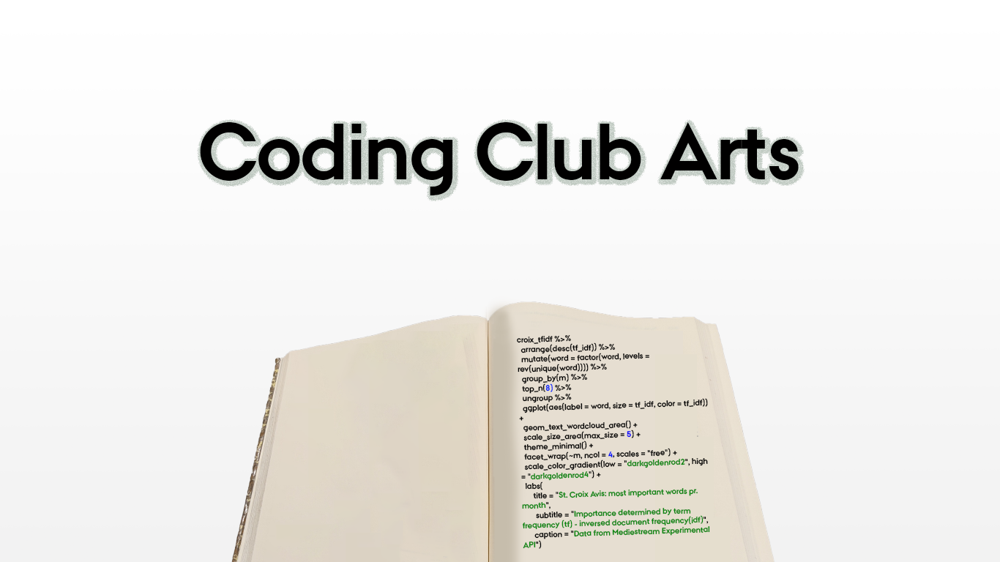

## Welcome to Coding Club Arts!
Coding Club Arts - also called smARTwork - is a creative coding club for all students in the humanities. We meet once a week and help each other, learn, inspire, discuss and play with coding aspects of the humanities. For more information about where and when to meet, please visit this our facebook page: [https://www.facebook.com/groups/564726104661699](https://www.facebook.com/groups/564726104661699). On facebook we will also share information about upcoming events like worhskops, showcases etc. 

On this page you will find some useful information about how to get started on different coding languages, what one can do with digital aspects in the humanities, inspiration on projects etc. 

For now we are focusing on the coding languages python, processing and R, but feel free to join whichever programming language you prefer!

## Python
Information will soon be updated

## Processing
Information will soon be updated

## R
To work in R you first need to install the programming language R and then the workspace Rstudio, which makes it more convenient to work with R.

- First download R via [https://cran.r-project.org/](https://cran.r-project.org/).
- Next download Rstudio IDE via [https://rstudio.com](https://rstudio.com).

