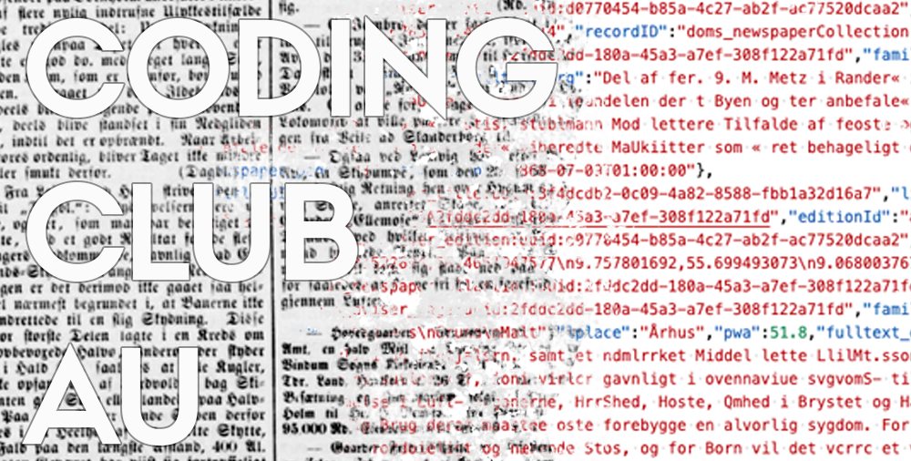

## Welcome to Coding Club Arts!
Coding Club Arts - also called smARTwork - is a creative coding club for all students in the humanities. We meet once a week and help each other, learn, inspire, discuss and play with coding aspects of the humanities. For more information about where and when to meet, please visit our facebook [page](https://www.facebook.com/groups/564726104661699). On facebook we will also share information about upcoming events like worhskops, showcases etc. 

On this page you will find some useful information about how to get started on different coding languages, what one can do with digital aspects in the humanities, inspiration on projects etc. 

For now we are focusing on the coding languages python, processing and R, but feel free to join whichever programming language you prefer!

## Calendar Fall 21 
- 29/10: Text Mining Basic
- 5/11: Text Mining Next Step
- 12/11: Simple Machine Learning for Text Analysis
- 19/11: No coding Club due to Data Sprint event
- 26/11: Text Analysis and Statistics
- 3/12: End of the semester Christmas Coding

## Python
Information will soon be updated

You can download python [here](https://www.python.org/downloads/), or use an online version (search for python online).

You can find the course in 'Simple Machine Learning for Text Analysis' [here](https://colab.research.google.com/drive/1x6v1_08owVYbhDiV-LNYo-MgbLWROp5B?usp=sharing&fbclid=IwAR3ReDkjPQaxDl2IvqJaUyUbjzcSbIzudGiOuas_VCsKpBjDLTspTdpXLHw#scrollTo=781ad1db). Thanks big thanks to Phillip for sharing his code!

## R
To work with R you first need to install the programming language R and then the workspace Rstudio, which makes it more convenient to work with R.

- First download R via [https://cran.r-project.org/](https://cran.r-project.org/).
- Next download Rstudio IDE via [https://rstudio.com](https://rstudio.com).

## Processing
Information will soon be updated

